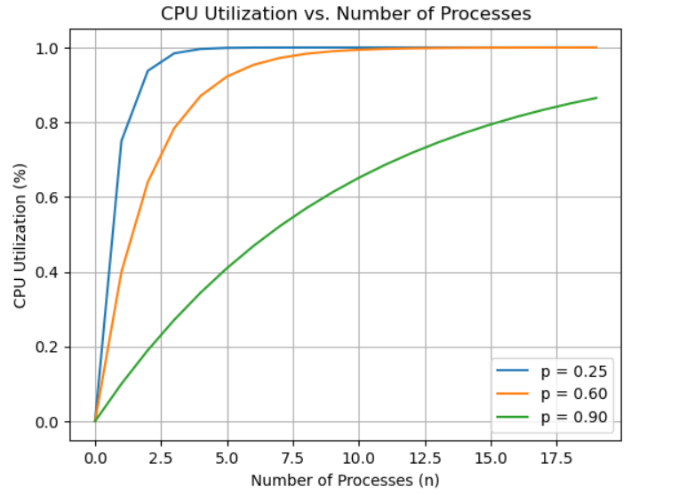

# Non-programming Exercise

## Ex.1

1. The probability for n processes to be waiting at the same time is `p^n`. The CPU utilisation is `1-p^n`.

2. 

3. 
    a. floor((256 - 96) / 48) = 3 processes.
    
    b. 1 - 0.9 ^ 3 = 0.271 = 27.1%
    
    c. adding 256 MB: 512MB, 8 processes, cpu utilization: 0.569533
       
       adding 512 MB: 768MB, 14 processes, cpu utilization: 0.771232
       
       adding 1024 MB: 1024MB, 24 processes, cpu utilization: 0.920234

       For utilization of cpu, the more memory, the better. But I will chose adding 256 MB considering the price, and that worth the investment.

## Ex.2

First I find that in `/usr/src/servers/is/dmp.c` there are a lot of key settings in `hooks`, which is an array of struct hook_entry, like:

```c
{ F1, 	proctab_dmp, "Kernel process table" },
```

So I add

```c
{ SF7,  proccnt_dmp, "Running process number"},
```

Then in `/usr/src/servers/is/dmp_kernel.c`, I include a header file `/src/servers/pm/mproc.h` and a function:

```c
#include "../pm/mproc.h"

/* proccnt_dmp */
void proccnt_dmp()
{
    struct mproc *pc;
    int cnt = 0;
    if (getsysinfo(PM_PROC_NR, SI_PROC_TAB, mproc, sizeof(mproc)) != OK)
    {
        printf("Get Process Count Error.\n");
        return;
    }
    int i;
    for (i = 0; i < NR_PROCS; i++)
    { // mproc[NR_PROCS]
        pc = &mproc[i];
        if (pc->mp_pid == 0 && i != PM_PROC_NR)
            continue; // Signaled by PM, ignore
        cnt++;
    }
    printf("Current number of running processes: %d\n", cnt);
}
```

Finally in `/usr/src/servers/is/proto.h`, add the declaration:

```c
void proccnt_dmp(void);
```

To compile and test, run:

```shell
cd /usr/src
make build
reboot
```

       
