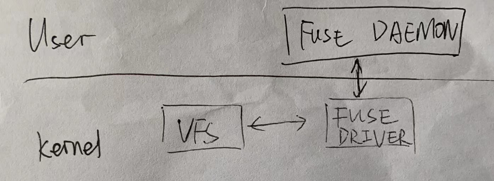

# Non-programming Exercise

### What is a file system?
The goal of a file system contains:
1. Store large amount of data
2. Long term storage
3. Information shared among multiple processes

### How is the Linux VFS working?
1. It is another layer of indirection in Linux
2. It is between POSIX system calls and different file systems (can be kernel modules).
3. It uses the struct inode to represent a file

### What is FUSE, and how does it interact with the VFS? Can you sketch it quickly to make it clearer?
1. It is file system in user space. It contains a driver in kernel space to interact with VFS, and a daemon library in user space to deal with file operations and to interact with the driver.


### Explain what is SSHFS.

sshfs (SSH File System) is a network file system protocol that enables you to mount remote directories over a secure SSH (Secure Shell) connection. It allows you to access and interact with files on a remote server as if they were on your local machine. sshfs relies on the SSH protocol for secure data communication and authentication.

### Use SSHFS to mount your home on Lemonion Inc. server in your computer.

```bash
sshfs 520021910400@lemonion:~/ /mnt/lemonion-home
```

### What are the benefits of using SSHFS?

It is safe, can be used anywhere, cross-platform, and easy to use.
